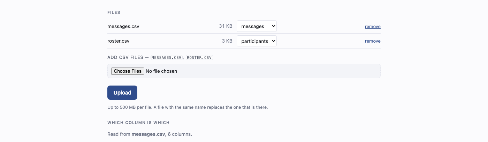
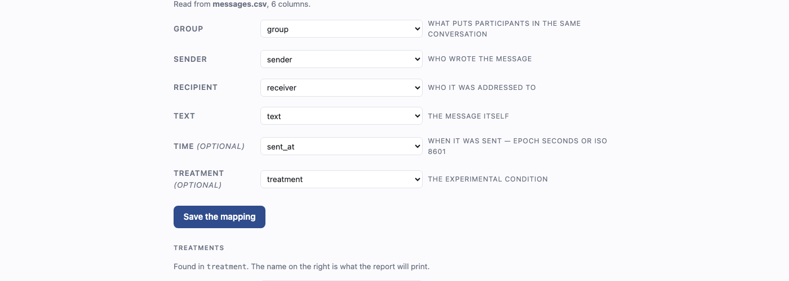
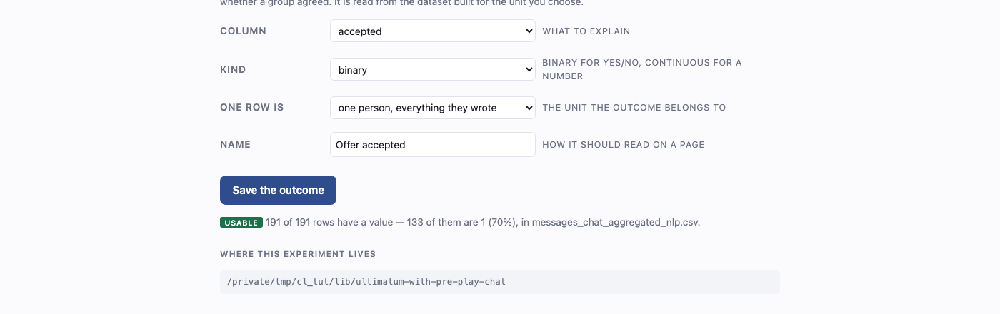
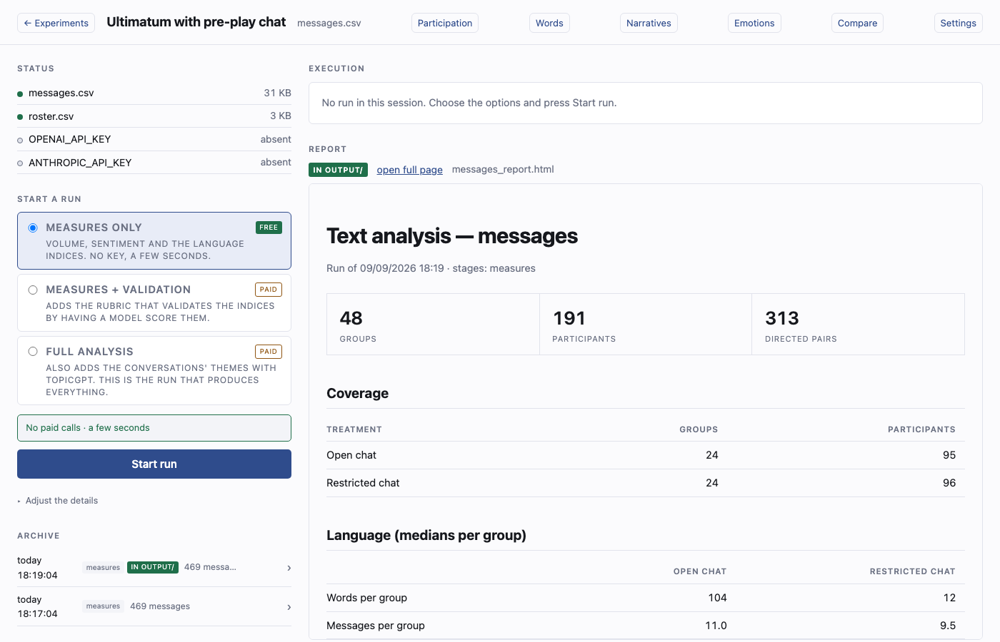
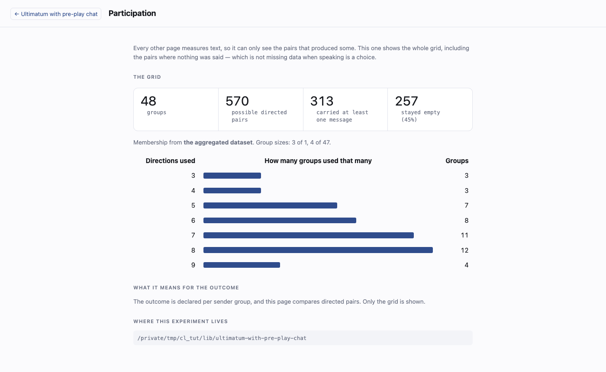
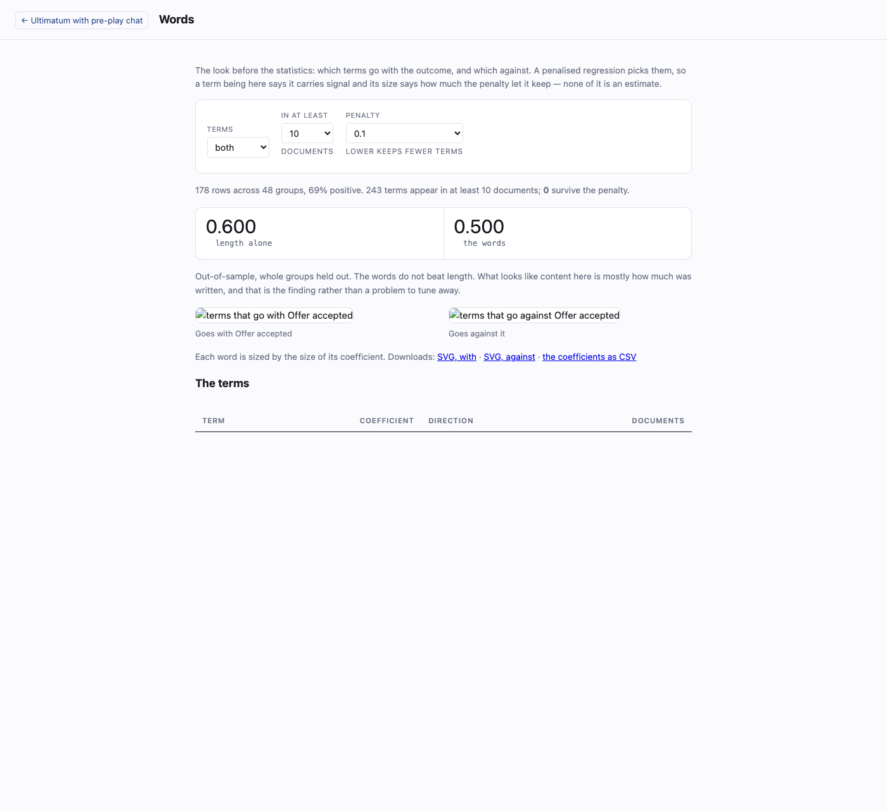
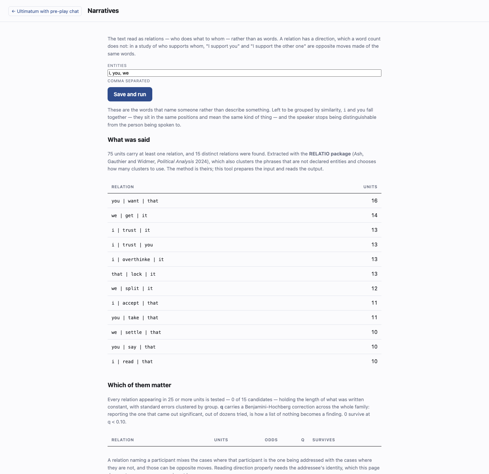
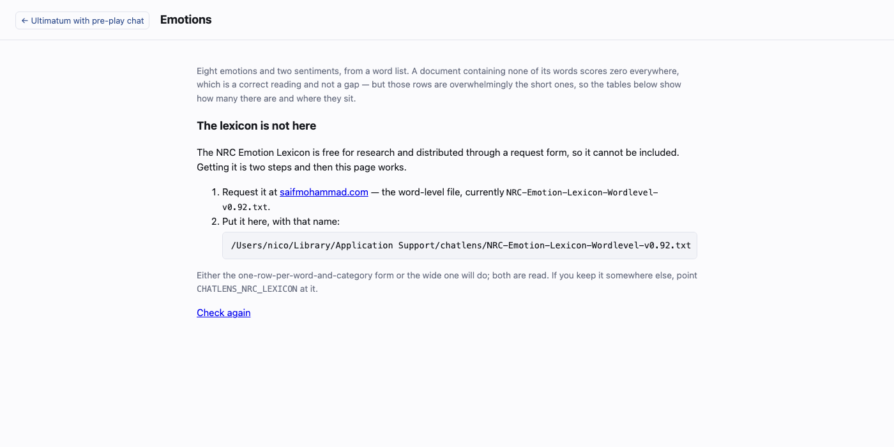
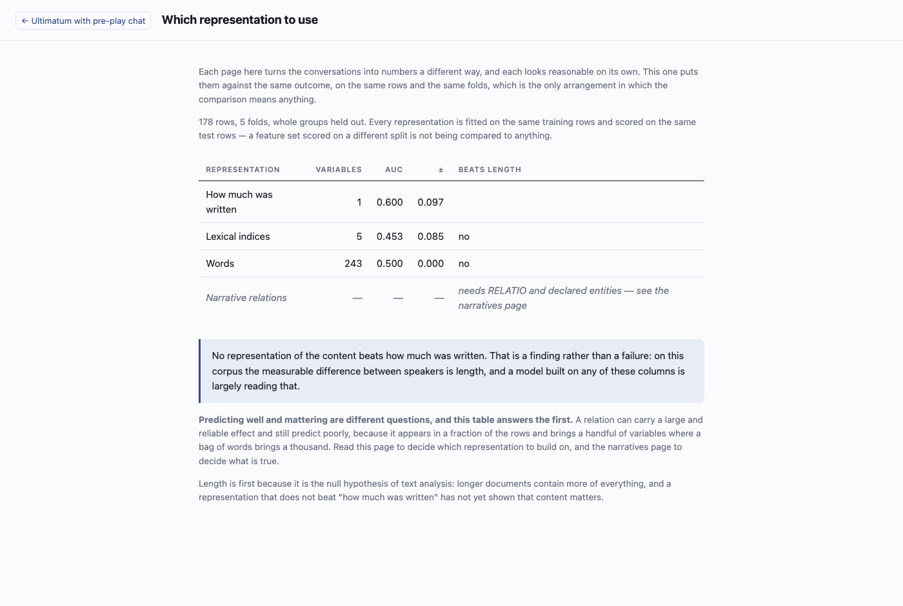

# A walk through, with pictures

Everything below is one real session on a study that belongs to nobody:
`chatlens demo` writes forty-eight groups of four with two treatments, and the
pictures are of that, taken from the running dashboard rather than drawn.

You can follow along exactly. The commands are in
`scripts/tutorial/` and rebuild every figure on this page.

### 1. Make an experiment

```bash
chatlens dashboard
```


The library is empty on a new install. Name the study, say what shape the data
is in — one message per row, or an oTree coalition export — and press Create.
The card that appears says what is still missing, and here it is the files.

### 2. Upload the files



Under **Settings**, drop the CSVs in. Each one gets a role from the dropdown
beside it: which is the messages file, which is the roster. That is the step
that makes the tool work with an export whose filename is not one it expected —
you say what a file *is* rather than renaming it to suit.

### 3. Say which column is which



The dropdowns are filled from the header of the file you just uploaded, so you
are choosing among your own column names, not typing them. They arrive already
guessed: `group`, `sender`, `receiver`, `text` are recognised, and in the
ordinary case the whole step is confirming what is already selected.

### 4. Say what the analysis should explain



This is the one setting the rest depends on. Point at the column holding the
outcome — here `accepted`, from the roster — say whether it is binary or
continuous, and say **at which unit** one row lives: a directed pair, a pair,
a person, a group.

The unit is not a formality. Fit a model at the wrong one and each group's value
is silently repeated across its members, and the result reports a precision it
has not got.

Underneath, the page reads the column and tells you what it found: *191 of 191
rows have a value — 133 of them are 1 (70%)*. A column that is really a
participant code looks obviously wrong the moment its distribution is shown, and
looks like nothing at all until then.

### 5. Run it



**Measures only** is free, needs no key, and takes a few seconds. The other two
presets add the validation rubric and the topics, which call an API and cost
money — the page says which is which before you press anything.

Every run is archived, so running again does not erase the last one.

### 6. Who spoke to whom



Start here, because it needs nothing and on the study this tool was built for it
held the strongest result in the dataset.

Every other page measures text, so it can only see the pairs that produced some.
This one shows the whole grid: 48 groups, 570 possible directed pairs, **257 of
which stayed empty**. Those are not missing data. Somebody chose not to write.

The bars show how many of the possible directions each group actually used, and
the shape of that is usually more interesting than the average of it.

### 7. Which words go with the outcome



A penalised regression over unigrams and bigrams, drawn as two clouds — terms
that go with the outcome, terms that go against — and listed underneath with
their coefficients. Downloads as PNG, SVG and CSV.

The control worth moving is the **penalty**. Lower it and the model keeps fewer
terms; raise it and it keeps hundreds. Watching them appear and disappear is the
quickest way to see how fragile the selection is, which a single table hides.

Above the clouds, always, is length alone. If the words do not beat it, the page
says so — because a bag of words that does not beat "how much was written" has
not shown that content matters.

### 8. Who does what to whom



The same text read as relations rather than as words, using RELATIO. A relation
comes out of a sentence, so nothing has to be generalisable at the level of a
whole conversation; and a relation has a **direction**, which a word count
cannot represent.

The page will not run until you name the entities, and that is deliberate. Left
to be grouped by similarity, `i` and `you` fall together — they sit in the same
positions and mean the same kind of thing — and the speaker stops being
distinguishable from the person being spoken to.

Every relation common enough to test is tested, with length held constant and a
correction for having tested many. Nothing is reported because it happened to
come out significant.

### 9. Emotions



This is what a new installation shows: the NRC lexicon is free for research and
distributed through a form, so it is not shipped. The page says where to request
it, where to put it, and that `tidytext::get_sentiments("nrc")` is the quicker
route if you have R.

It is worth seeing this screen rather than hiding it. A page that fails silently
teaches nothing; one that says exactly what is missing and how to get it can be
acted on in a minute.

### 10. Which of them is worth using



All of it against the same outcome, on the same rows and the same folds. This is
the page that answers the practical question, and the one to read before
building anything on a set of columns.

Length is the first row, because it is the null hypothesis of text analysis. A
representation that could not be built appears with its reason rather than being
left out: comparing three things while the reader believes they are seeing five
is the worse failure.

### Rebuilding these pictures

```bash
python scripts/tutorial/prepare.py --library /tmp/chatlens-tutorial
chatlens dashboard --library /tmp/chatlens-tutorial
python scripts/tutorial/shoot.py --token <the key it printed>
```

Every figure on this page is regenerated at once, which is the only way a guide
with pictures stays true after the interface changes.
