# chatlens — a guide

Text analysis of the conversations held during a behavioural experiment: what
was said, by whom, to whom, and which of it is worth building a result on.

Every figure here is a screenshot of the tool running on the coalition-formation
study it was built for — 509 groups, 8,077 messages, three treatments. They show
real numbers rather than a demonstration, which is the only way to see whether a
finding is worth having.

> **On the data in these figures.** The screens that show the conversations
> themselves carry what participants actually wrote to one another. If this
> guide is going to be forwarded or published, regenerate its figures on the
> synthetic study instead — `chatlens demo` writes one from a fixed seed that
> belongs to nobody, and every step below works the same on it.

## Contents

1. [What this is for](#1-what-this-is-for)
2. [What it can do](#2-what-it-can-do)
3. [Installing it](#3-installing-it)
4. [The five steps](#4-the-five-steps)
5. [The findings](#5-the-findings)
6. [Reading the conversations](#6-reading-the-conversations)
7. [A complete session](#7-a-complete-session)
8. [Where things live](#8-where-things-live)

---

## 1. What this is for

An experiment with a chat produces two kinds of data. The choices — who offered
what, who accepted — are already numbers. The conversations are not, and turning
them into numbers is where the difficulty is, because there are many ways to do
it and they do not agree.

chatlens does that turning, several different ways, and then does something less
usual: it puts them side by side against the same outcome and tells you which
one is actually carrying anything.

**One idea runs through the whole tool.** Longer messages contain more of
everything — more positive words, more relations, more of any term you care to
count. So a text measure that looks impressive is often measuring how much
somebody typed. Every finding that predicts anything shows message length beside
the model, and says plainly when length wins.

On the study shown here it does not win — the words reach 0.691 against 0.595
for length alone — but on a corpus of shorter messages it usually does, and this
tool is built to tell you so rather than to flatter the result.

## 2. What it can do

**It answers six questions,** and says which of them it could answer.

| Question | What it comes from |
|---|---|
| What was said | the conversations themselves, read and searchable |
| Who spoke to whom | every ordered pair, including the ones that stayed silent |
| Which representation to trust | every method scored against the same outcome, on the same folds |
| The words | a penalised regression over unigrams and bigrams |
| The relations | who does what to whom, through the RELATIO package |
| The emotions | ten categories from the NRC word list |

**Nothing is a black box.** Every number leads back to the sentences behind it:
click a term and the messages that contain it open under the table.

**It says when it cannot answer.** Two of the six need packages that are not
installed by default, and one needs a lexicon that is free but distributed
through a request form. Those findings stay in the list and say what would
unblock them, rather than disappearing.

## 3. Installing it

```bash
uv tool install git+https://github.com/nicomil/chatlens.git
chatlens dashboard
```

That is the whole of it for the descriptive half. The findings that fit models
need more, and each says so on its own screen with the command to run — built
from the interpreter chatlens is actually installed in, which is the part people
get wrong when they type it themselves.

| Finding | What it needs | Roughly |
|---|---|---|
| The words, Which representation to trust | scikit-learn, matplotlib, wordcloud | 150 MB |
| The relations | spaCy + a language model + statsmodels + RELATIO | 1.6 GB |
| The emotions | the NRC Emotion Lexicon | 4 MB |

The relations take three steps rather than one — the extra, the language model
and RELATIO are separate downloads, and all three are needed. Each screen prints
the commands in order.

```bash
chatlens install-model       # the spaCy language model, 33 MB
chatlens install-relatio     # clones and installs RELATIO, 1.6 GB
chatlens install-topicgpt    # only for the paid topic stage
```

The full account, including where everything ends up on each operating system,
is in the README's [installation section](02-installation.md#installation).

## 4. The five steps

A study has a life, and the bar across the top of every screen is that life:
**Data, Columns, Outcome, Run, Findings.** Each step says whether it is
finished. Opening a study takes you to the first one that is not.

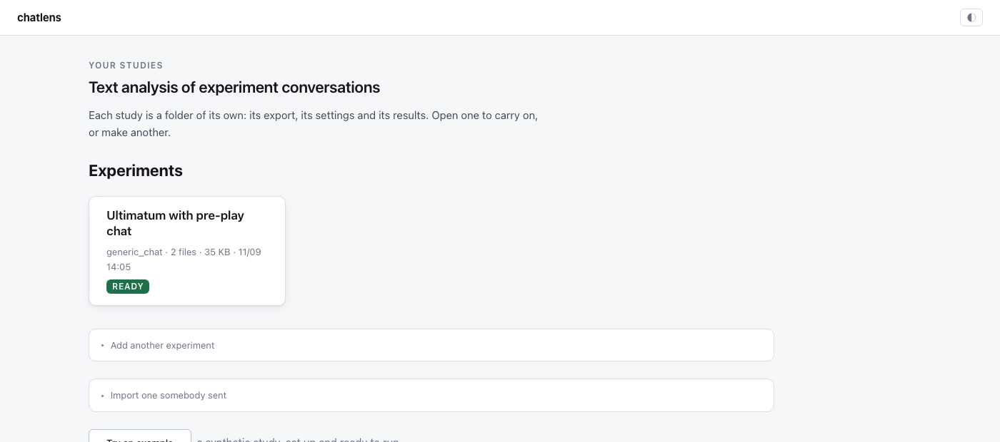

The library is the studies on this machine. Each is a folder of its own — its
export, its settings, its results — so one can be copied to a colleague or
included in a backup. **Import one somebody sent** opens a study a colleague
exported, results and all (§5.7). **Try an example** makes a synthetic study, set up and
ready to run, for anyone who wants to see the procedure before committing their
own data to it.

### 4.1 Data

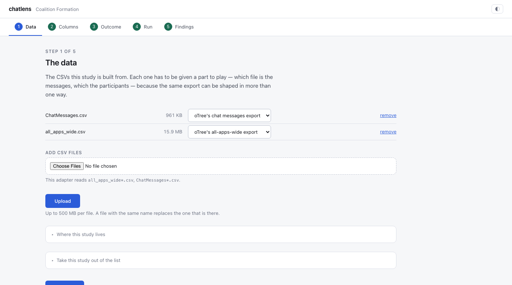

The CSVs the study is built from, and what part each plays. The same export can
be shaped more than one way, so the roles are chosen rather than guessed: which
file is the messages, which the participants.

For an oTree coalition export there is nothing to choose — the adapter reads
`all_apps_wide.csv` and `ChatMessages.csv` directly and reconstructs the groups,
the channels and the choices.

### 4.2 Columns

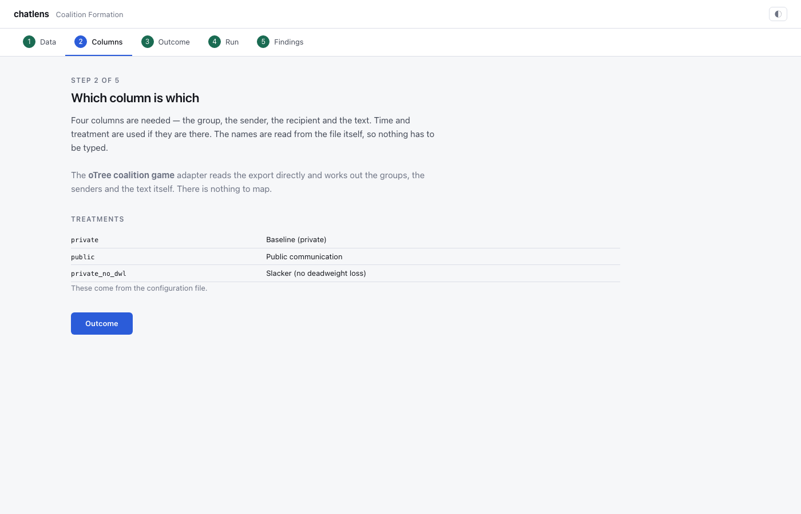

Four columns are needed: the group, the sender, the recipient, the text. Time
and treatment are used if they are there. The names are read from the file's own
header and pre-selected by a guess, so in the ordinary case this step is a
confirmation rather than a form.

Below it, the treatments: their values are read from the column, and each gets
the name the report should print.

### 4.3 Outcome

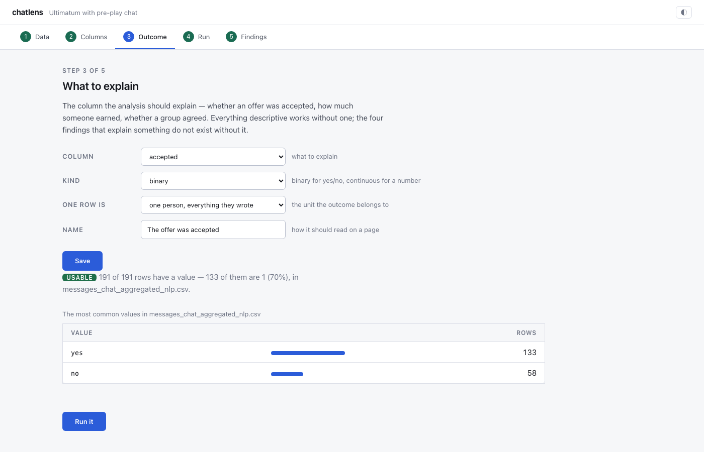

The column the analysis should explain — whether an offer was accepted, how much
someone earned, whether a group agreed. Everything descriptive works without
one; the findings that explain something do not exist without it.

**Two things on this screen deserve the attention.** The first is the *unit*:
one row can be a directed pair, a pair, a person, or a whole group, and a model
fitted at the wrong one silently repeats each group's value across its members
and reports a precision it has not got. The second is the distribution
underneath — the actual values of the column you chose. A column that turns out
to be a participant code or a timestamp looks obviously wrong the moment its
values are on screen, and looks like nothing at all until then.

### 4.4 Run

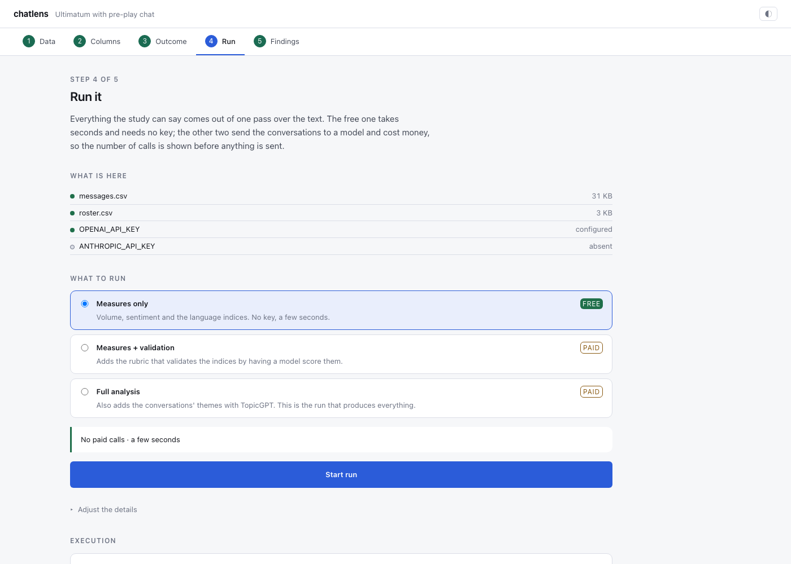

Three presets. **Measures only** is free, needs no key and takes seconds:
volume, sentiment and the language indices. The other two send the conversations
to a model and cost money, so the number of paid calls is shown before anything
is sent, and a figure that looks like a typo is refused outright.

The log is the run as it happens, with the progress bars collapsed to one line
each. A run can be stopped from its header. Earlier runs are kept below, each
with the files it produced.

## 5. The findings

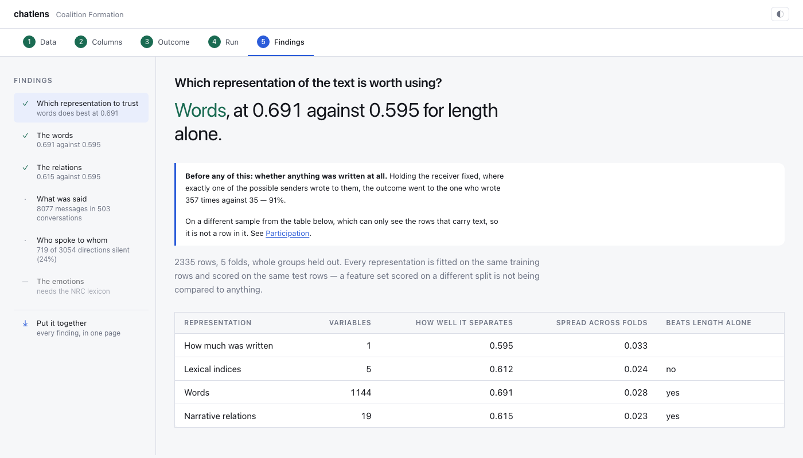

The register on the left is the six questions, each with what was found:

- **✓** the representation beats length;
- **✗** it does not. This is not an error and is not drawn as one — on a corpus
  of short messages it is the commonest honest answer;
- **—** it could not be computed here, with the reason.

Every finding has the same shape: the question, the answer in the largest type
on the screen, then the evidence, then the detail, then the reasoning behind a
panel you can open if you want it.

### 5.1 Which representation to trust

The table that decides what to build on. Every representation is fitted on the
same training rows and scored on the same test rows, whole groups held out — a
feature set scored on a different split is not being compared to anything.

| Representation | Variables | Separates |
|---|---|---|
| How much was written | 1 | 0.595 |
| Lexical indices | 5 | 0.612 |
| Narrative relations | 19 | 0.615 |
| Words | 1,144 | **0.691** |

On this corpus the words win. It is worth seeing why that is not obvious: they
bring 1,144 variables where the relations bring 19, and predicting well and
mattering are different questions. A relation can carry a large and reliable
effect and still predict poorly, because it appears in a fraction of the rows.

### 5.2 Who spoke to whom

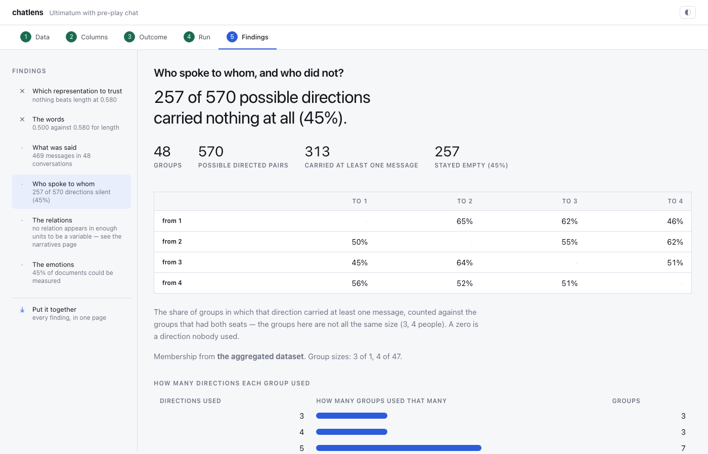

Every other finding measures text, so it can only see the pairs that produced
some. This one shows the whole grid, including the pairs where nothing was said
— which is not missing data when speaking is a choice.

**719 of 3,054 possible directions carried nothing at all.** The matrix is who
wrote to whom, by seat, as a share of the groups that had both seats; a zero is
a direction nobody used.

And under it, the result that is not in the text at all. Holding the receiver
fixed — a person facing exactly two candidates, one of whom wrote to them and
one of whom did not — **the choice went to the one who wrote 357 times against
35.** No word count is needed to see that.

### 5.3 The words

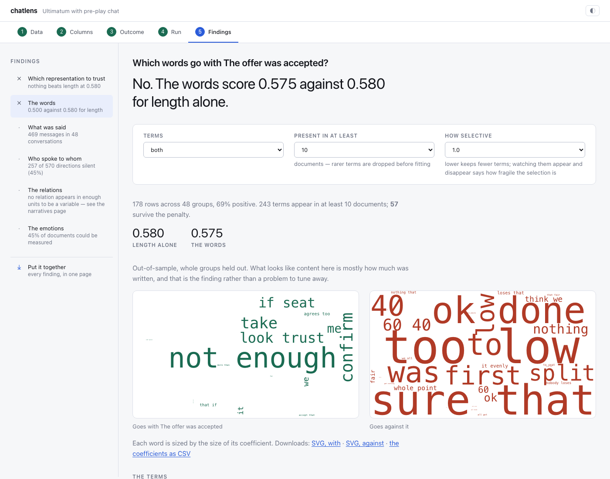

A penalised regression picks the terms, so a term being here says it carries
signal and its size says how much the penalty let it keep. None of it is an
estimate of an effect.

Each term is drawn with its magnitude and coloured by direction, and each is a
control: click one and the messages it came from open below.

**The penalty is the knob worth moving.** Watching terms appear and disappear as
it changes says how fragile the selection is, which a single table hides.

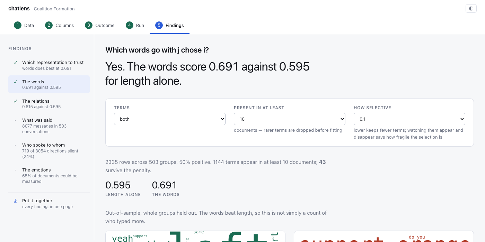

The two clouds are the same information as the table, sized by coefficient and
split by direction — one image cannot show both directions without the reader
having to guess which large word means which.

### 5.4 The relations

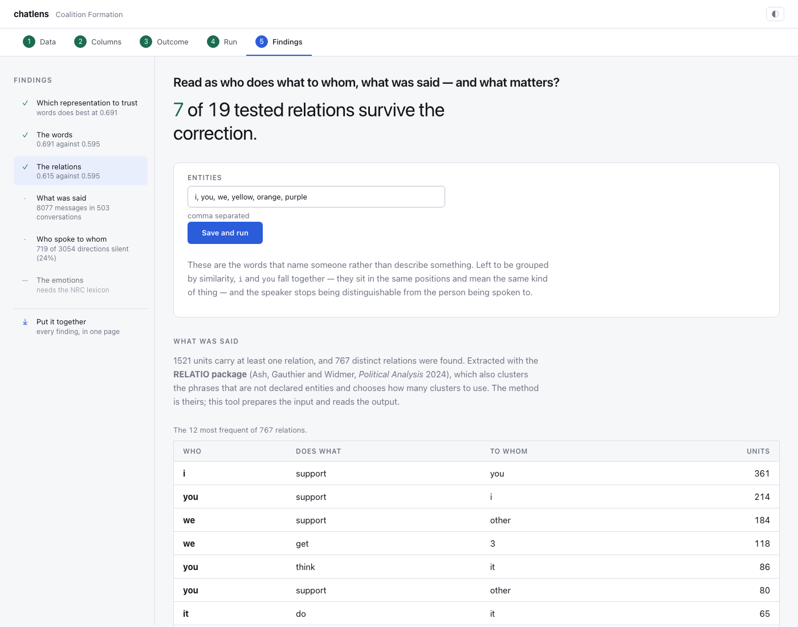

The text read as relations — who does what to whom — rather than as words. A
relation has a direction, which a word count does not: in a study of who
supports whom, "I support you" and "I support the other one" are opposite moves
made of the same words.

The extraction is the RELATIO package's (Ash, Gauthier and Widmer, *Political
Analysis* 2024). It needs to be told which words name a participant rather than
describe something — here `i, you, we` and the three seat colours. Left to be
grouped by similarity, "i" and "you" fall together and the speaker stops being
distinguishable from the person spoken to.

On this corpus, 1,521 units carry at least one relation and 767 distinct
relations were found, `i support you` most often. Of the 19 that appear in
enough units to be worth testing, **7 survive a Benjamini–Hochberg correction
across the whole family** — which is the point of testing them together rather
than reporting the one that came out significant.

### 5.5 The emotions

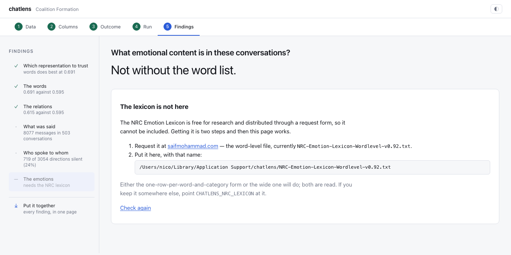

Ten categories from the NRC Emotion Lexicon — eight emotions, two sentiments —
counted over the same documents as everything else.

The finding leads with the figure that matters most, and it is not one of the
categories. **On this corpus 65% of the documents could be measured at all**;
the other 35% contain no word from the list. A document with no fear word has a
fear rating of zero and that is correct — nothing frightening was said — but a
document with *no listed word at all* scores zero on every category at once, and
those documents are not distributed at random. They are the short ones.

So these columns carry a signal about how much was written mixed into the one
about emotion, and the length quartiles under the headline say how much of that
there is. The fix is the same as everywhere else in this tool: keep the zeros
and put length in the model.

Until the lexicon is on the machine this finding shows what a blocked one looks
like — the question, a plain statement that it cannot be answered yet, and the
three ways to get the file: the request form, an export from R, or a copy you
already have pointed at by `CHATLENS_NRC_LEXICON`.

### 5.6 Put it together

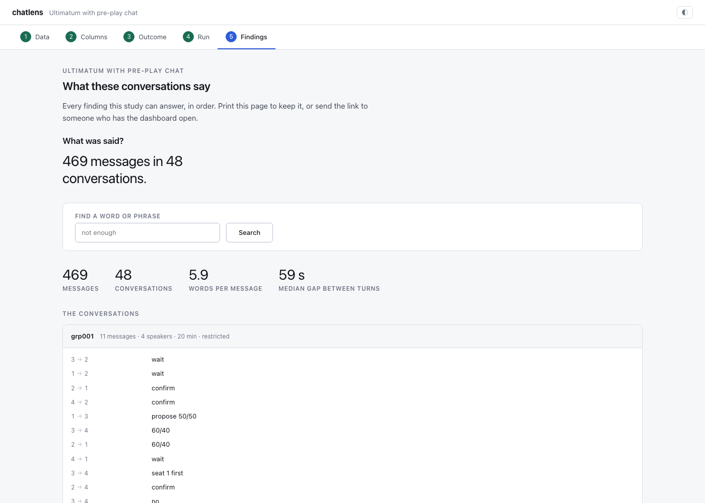

Every finding that has an answer, in one page, in order — and, at the end, the
ones that could not be computed and why. A summary that quietly dropped those
would show two answers with no sign that six questions had been asked.

### 5.7 Sending it to somebody

The page above is something to read. Below it are two buttons that send the
study itself — the configuration, the data and everything already computed, in
one file. Whoever receives it imports it from their own library page and every
finding is there, with nothing to run again: the rubric cache and TopicGPT's
output are inside, so nobody pays twice for the same answers.

The same thing from the terminal:

```bash
chatlens export coalition-formation      # then send the file
chatlens import coalition-formation.chatlens.tar.gz
```

The second button downloads the same study with the participant identifiers
replaced, using a key made for that file and then thrown away. The chat texts
travel either way, and people write their names in them. The API keys and the
pseudonym key never travel at all.

## 6. Reading the conversations

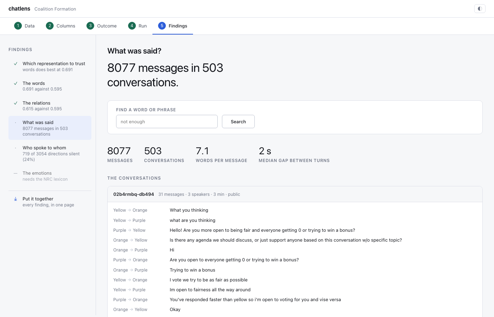

Every other screen measures the text. This one shows it: the conversations
grouped as they happened and in the order they happened, with the shape of each
exchange beside it — how long it lasted, how fast the turns came, how many words
a message carried.

There is a search over the message bodies, and the matches are marked where they
appear.

**The inspector is the part that matters.** A term in the coefficient table, a
relation in the narratives one — click it and the messages behind it open in a
drawer at the foot of the window, so you can go from term to term without losing
your place in the table.

It reports two counts and says which is which, because confusing them
misrepresents the model: a term's *documents* are units at the outcome's level,
and one unit can hold several messages.

## 7. A complete session

From nothing to an answer, on a machine where chatlens has just been installed.

1. `chatlens dashboard` — the library opens, empty.
2. **Try an example**, or make a study and give it your export.
3. **Data** — the files get their roles. For an oTree export there is nothing to
   choose.
4. **Columns** — confirm the mapping the guess proposed; name the treatments.
5. **Outcome** — the column, its kind, and above all its *unit*. Look at the
   distribution underneath before going on.
6. **Run** — *Measures only*. Seconds, no key, no cost.
7. **Findings** — the register fills in as the numbers arrive. Start with
   *Which representation to trust*: it says which of the others is worth
   reading.
8. Click a term. Read the messages. That is the step that decides whether you
   believe the number.
9. **Put it together** when you want to send it to somebody.

## 8. Where things live

A study is one folder:

```
<library>/my-study/
├── experiment.toml     name, adapter, columns, treatments, outcome, entities
├── input/              the export, exactly as it came
└── output/
    ├── merged/         the canonical message tables
    ├── datasets/       the tables with the measures, for Stata or R
    ├── features/       the intermediate measures
    ├── runs/           every run, archived, with what it produced
    └── *_report.html   the readable summary
```

Everything about one study is in its own folder, so it can be copied to a
colleague or included in a backup complete.

What is *not* in it, deliberately: the API keys, the TopicGPT and RELATIO
clones, and the NRC lexicon. Those belong to the machine rather than to a study,
and copying keys into a folder you then send someone is a mistake worth making
structurally impossible.

The library lives in this machine's application data directory —
`~/Library/Application Support/chatlens/experiments` on macOS,
`%LOCALAPPDATA%\chatlens\experiments` on Windows,
`~/.local/share/chatlens/experiments` on Linux. The dashboard prints the path.
It is a folder your backups may not cover by default, and if these are
participant data, that is worth checking.

**`input/` holds the export as it came, participant identifiers included.** It
is outside your repository, which also means it is outside the places you look
when you tidy one.
