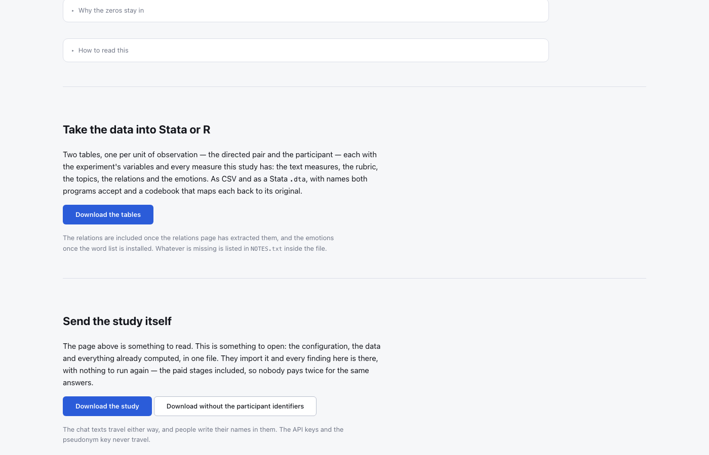

# chatlens — a guide

Text analysis of the conversations held during a behavioural experiment: what
was said, by whom, to whom, and which of it is worth building a result on.

Every figure here is a screenshot of the tool running on the synthetic study
that `chatlens demo` writes — an ultimatum game with a chat before the offer,
48 groups, 192 participants, 469 messages, generated from a fixed seed and
belonging to nobody. It is small on purpose, and on a corpus this small the
honest answer to most questions is that message length explains more than
anything said. The guide shows that answer rather than a flattering one, and
says beside each finding what it looked like on the coalition-formation study
the tool was built for.

## Contents

1. [What this is for](#1-what-this-is-for)
2. [What it can do](#2-what-it-can-do)
3. [Installing it](#3-installing-it)
4. [The five steps](#4-the-five-steps)
5. [The findings](#5-the-findings)
6. [Reading the conversations](#6-reading-the-conversations)
7. [A complete session](#7-a-complete-session)
8. [Where things live](#8-where-things-live)

---

## 1. What this is for

An experiment with a chat produces two kinds of data. The choices — who offered
what, who accepted — are already numbers. The conversations are not, and turning
them into numbers is where the difficulty is, because there are many ways to do
it and they do not agree.

chatlens does that turning, several different ways, and then does something less
usual: it puts them side by side against the same outcome and tells you which
one is actually carrying anything. Then it hands all of it over, one table per
unit of observation, ready for Stata or R.

**One idea runs through the whole tool.** Longer messages contain more of
everything — more positive words, more relations, more of any term you care to
count. So a text measure that looks impressive is often measuring how much
somebody typed. Every finding that predicts anything shows message length beside
the model, and says plainly when length wins.

On the synthetic study shown here it wins: nothing beats 0.580, the score of
length alone. On the coalition-formation study the words reached 0.689 against
0.596 — so the tool can say yes, and does when it should.

## 2. What it can do

**It answers six questions,** and says which of them it could answer.

| Question | What it comes from |
|---|---|
| What was said | the conversations themselves, read and searchable |
| Who spoke to whom | every ordered pair, including the ones that stayed silent |
| Which representation to trust | every method scored against the same outcome, on the same folds |
| The words | a penalised regression over unigrams and bigrams |
| The relations | who does what to whom, through the RELATIO package |
| The emotions | ten categories from the NRC word list |

**Nothing is a black box.** Every number leads back to the sentences behind it:
click a term and the messages that contain it open under the table.

**It says when it cannot answer.** Two of the six need packages that are not
installed by default, and one needs a lexicon that is free but distributed
through a request form. Those findings stay in the list and say what would
unblock them, rather than disappearing.

**It hands everything over.** Two tables — one row per directed pair, one per
participant — with the experiment's variables and every measure, the relations
and emotions included, as CSV for R and `.dta` for Stata, with a codebook
(§5.7). And a whole study travels as one file, so a colleague opens it with
every result already computed (§5.8).

## 3. Installing it

```bash
uv tool install git+https://github.com/nicomil/chatlens.git
chatlens dashboard
```

That is the whole of it for the descriptive half. The findings that fit models
need more, and each says so on its own screen with the command to run — built
from the interpreter chatlens is actually installed in, which is the part people
get wrong when they type it themselves.

| Finding | What it needs | Roughly |
|---|---|---|
| The words, Which representation to trust | scikit-learn, matplotlib, wordcloud | 150 MB |
| The relations | spaCy + a language model + statsmodels + RELATIO | 1.6 GB |
| The emotions | the NRC Emotion Lexicon | 4 MB |
| The `.dta` files for Stata | pandas (the `stata` extra) | 130 MB |

The relations take three steps rather than one — the extra, the language model
and RELATIO are separate downloads, and all three are needed to *extract* them.
Each screen prints the commands in order.

```bash
chatlens install-model       # the spaCy language model, 33 MB
chatlens install-relatio     # clones and installs RELATIO, 1.6 GB
chatlens install-topicgpt    # only for the paid topic stage
```

**Reading relations somebody else extracted needs none of it.** A study
imported from a colleague carries RELATIO's output, and the relations page shows
it on a machine that has never installed the package — as long as the entities
stay as they arrived.

The full account, including where everything ends up on each operating system,
is in [installation](installation.md).

## 4. The five steps

A study has a life, and the bar across the top of every screen is that life:
**Data, Columns, Outcome, Run, Findings.** Each step says whether it is
finished. Opening a study takes you to the first one that is not.


The library is the studies on this machine. Each is a folder of its own — its
export, its settings, its results — so one can be copied to a colleague or
included in a backup. **Add another experiment** makes a new one, **Import one
somebody sent** opens a study a colleague exported, results and all (§5.8), and
**Try an example** makes the synthetic study, set up and ready to run, for anyone
who wants to see the procedure before committing their own data to it.

### 4.1 Data


The CSVs the study is built from, and what part each plays. The same export can
be shaped more than one way, so the roles are chosen rather than guessed: here
`messages.csv` is the messages, one per row, and `roster.csv` the participants,
joined onto their table.

For an oTree coalition export there is nothing to choose — the adapter reads
`all_apps_wide.csv` and `ChatMessages.csv` directly and reconstructs the groups,
the channels and the choices.

### 4.2 Columns


Four columns are needed: the group, the sender, the recipient, the text. Time
and treatment are used if they are there. The names are read from the file's own
header and pre-selected by a guess — on this study all six guesses were right,
so the step was a confirmation rather than a form.

Below it, the treatments: their values are read from the column, and each gets
the name the report should print — `restricted` and `open` became *Restricted
chat* and *Open chat*.

### 4.3 Outcome


The column the analysis should explain — whether an offer was accepted, how much
someone earned, whether a group agreed. Everything descriptive works without
one; the findings that explain something do not exist without it. Here it is
`accepted`, binary, one row per person.

**Two things on this screen deserve the attention.** The first is the *unit*:
one row can be a directed pair, a pair, a person, or a whole group, and a model
fitted at the wrong one silently repeats each group's value across its members
and reports a precision it has not got. The second is the distribution
underneath — the actual values of the column you chose. A column that turns out
to be a participant code or a timestamp looks obviously wrong the moment its
values are on screen, and looks like nothing at all until then. Here all 191
rows have a value, 133 of them *yes* — usable, and the screen says so. Before
the first run there is no dataset to read the column from, and it says that
instead.

### 4.4 Run


Three presets. **Measures only** is free, needs no key and takes seconds:
volume, sentiment and the language indices — on this study, under a second for
469 messages. The other two send the conversations to a model and cost money, so
the number of paid calls is shown before anything is sent, and a figure that
looks like a typo is refused outright.

The log is the run as it happens, with the progress bars collapsed to one line
each. A run can be stopped from its header. Earlier runs are kept below, each
with the files it produced.

A paid run that stops halfway — a network blip, a spent credit balance — does
not have to be paid for again: `--topicgpt-reuse` skips every phase already
complete on disk (see [topics](topics.md)).

## 5. The findings


The register on the left is the six questions, each with what was found:

- **✓** the representation beats length;
- **✗** it does not. This is not an error and is not drawn as one — on a corpus
  of short messages it is the commonest honest answer;
- **·** a description rather than a verdict, or an answer with nothing to test;
- **—** it could not be computed here, with the reason.

Every finding has the same shape: the question, the answer in the largest type
on the screen, then the evidence, then the detail, then the reasoning behind a
panel you can open if you want it.

### 5.1 Which representation to trust

The table that decides what to build on. Every representation is fitted on the
same training rows and scored on the same test rows, whole groups held out — a
feature set scored on a different split is not being compared to anything.

| Representation | Variables | Separates |
|---|---|---|
| How much was written | 1 | **0.580** |
| Lexical indices | 5 | 0.539 |
| Words | 243 | 0.500 |
| Narrative relations | — | none frequent enough to be a variable |

On this corpus nothing beats length, and the page says so in its largest type:
*Nothing. No representation of the content beats how much was written.* That is
a finding rather than a failure — the measurable difference between speakers
here is how much they wrote, and a model built on any of these columns would
mostly be reading that.

On the coalition-formation study the same table came out the other way — the
words at 0.689 against 0.596 for length, the relations at 0.608 — and predicting
well and mattering are still different questions there: a relation can carry a
large and reliable effect and predict poorly, because it appears in a fraction
of the rows.

### 5.2 Who spoke to whom


Every other finding measures text, so it can only see the pairs that produced
some. This one shows the whole grid, including the pairs where nothing was said
— which is not missing data when speaking is a choice.

**257 of 570 possible directions carried nothing at all** (45%). The matrix is
who wrote to whom, by seat, as a share of the groups that had both seats; groups
here are not all the same size — one of three, 47 of four — and the page says
so under the grid.

When the outcome is declared per directed pair, the page adds the result that is
not in the text at all. On the coalition study, holding the receiver fixed — a
person facing two candidates, one of whom wrote to them and one of whom did not
— the choice went to the one who wrote 357 times against 35. Here the outcome is
per person, so only the grid is shown, and the page says why.

### 5.3 The words


A penalised regression picks the terms, so a term being here says it carries
signal and its size says how much the penalty let it keep. None of it is an
estimate of an effect.

Each term is drawn with its magnitude and coloured by direction, and each is a
control: click one and the messages it came from open below. On this study
*not enough* goes with the offer being accepted and *too low* against it — and
yet the words as a whole score 0.575 against 0.580 for length, which the page
puts above the clouds, where it cannot be missed.

**The penalty is the knob worth moving.** Watching terms appear and disappear as
it changes says how fragile the selection is, which a single table hides.


Tightened from 1.0 to 0.1, the 57 terms that survived become none, and the page
says there is nothing to draw rather than drawing an empty cloud. A selection
that vanishes under a modest change of penalty was never much of a selection.

### 5.4 The relations


The text read as relations — who does what to whom — rather than as words. A
relation has a direction, which a word count does not: in a study of who
supports whom, "I support you" and "I support the other one" are opposite moves
made of the same words.

The extraction is the RELATIO package's (Ash, Gauthier and Widmer, *Political
Analysis* 2024). It needs to be told which words name a participant rather than
describe something — here `i, you, we`. Left to be grouped by similarity, "i"
and "you" fall together and the speaker stops being distinguishable from the
person spoken to.

Here 73 units carry at least one relation and 16 distinct relations were found,
*seat tell i* and *you want it* most often. Only a relation that appears in 25
or more units is tested, and none does, so the answer is **Nothing to test** —
not a *no*, which would claim a test that never happened. On the coalition study
19 relations reached the threshold and 6 survived a Benjamini–Hochberg
correction across the whole family, which is the point of testing them together
rather than reporting the one that came out significant.

The extraction runs once and is kept with the study, so the page opens at once
the second time — and on a colleague's machine, from an exported study, without
RELATIO installed.

### 5.5 The emotions


Ten categories from the NRC Emotion Lexicon — eight emotions, two sentiments —
counted over the same documents as everything else.

The finding leads with the figure that matters most, and it is not one of the
categories. **On this study 45% of the documents could be measured at all**: 140
of the 311 with any text; the other 55% contain no word from the list. A document
with no fear word has a fear rating of zero and that is correct — nothing
frightening was said — but a document with *no listed word at all* scores zero
on every category at once, and those documents are not distributed at random.
They are the short ones: 82% of the one- and two-word documents are unmeasured,
against 38% of the longest.

So these columns carry a signal about how much was written mixed into the one
about emotion, and the length quartiles under the headline say how much of that
there is. The fix is the same as everywhere else in this tool: keep the zeros
and put length in the model.

Until the lexicon is on the machine this finding shows what a blocked one looks
like — the question, a plain statement that it cannot be answered yet, and the
three ways to get the file: the request form, an export from R, or a copy you
already have pointed at by `CHATLENS_NRC_LEXICON`.

### 5.6 Put it together


Every finding that has an answer, in one page, in order — and, at the end, the
ones that could not be computed and why. A summary that quietly dropped those
would show two answers with no sign that six questions had been asked.



At its foot, two ways to take the work elsewhere.

### 5.7 Taking the data into Stata or R

**Download the tables** gives a zip of two tables, one per unit of observation —
the directed pair and the participant — each with the experiment's variables and
every measure the study has: the text measures, the rubric, the topics, the
relations and the emotions. Two tables and not one, because a single rectangle
would have to repeat the participant on every pair or lose the pairs.

| File | |
|---|---|
| `…_chat_by_partner_full.csv` and `.dta` | one row per directed pair i→j |
| `…_chat_aggregated_full.csv` and `.dta` | one row per participant |
| `…_codebook.csv` | every column: its name here, the original, a label, where it came from |
| `NOTES.txt` | whatever could not be added, and why — only when something is missing |

The relations arrive as `rel_sent_n`, one 0/1 column per relation frequent
enough to test, and `rel_sent_all` — every relation the row sent, as text, for
a search by keyword that the frequent ones alone would miss. The emotions
arrive as `nrc_<block>_<category>`, a percentage of the words. A blank means
there was no text to measure, not a zero.

Every name is one both Stata and R accept, by one rule a script can rely on:
dots become underscores, and an oTree name too long for Stata's 32 characters
keeps its field and shortens the rest to initials —
`bargaining_tdl_intro.1.player.prolific_study_id` becomes
`bti_1_p_prolific_study_id`. In the `.dta` each variable is labelled with its
original name, and the codebook maps them all.

The same tables from the terminal, written to `output/tables/`:

```bash
chatlens tables
```

On the demo study the relations were extracted per person, the unit of its
outcome, so they reach only the participant table — and `NOTES.txt` says so
rather than leaving the pair table's missing columns to be discovered.

### 5.8 Sending it to somebody

The other two buttons send the study itself — the configuration, the data and
everything already computed, in one file. Whoever receives it imports it from
their own library page and every finding is there, with nothing to run again:
the rubric cache, TopicGPT's output and the extracted relations are inside, so
nobody pays twice for the same answers, and nobody needs RELATIO to read them.

The same thing from the terminal:

```bash
chatlens export coalition-formation      # then send the file
chatlens import coalition-formation.chatlens.tar.gz
```

The second button downloads the same study with the participant identifiers
replaced, using a key made for that file and then thrown away. The chat texts
travel either way, and people write their names in them. The API keys and the
pseudonym key never travel at all.

## 6. Reading the conversations


Every other screen measures the text. This one shows it: the conversations
grouped as they happened and in the order they happened, with the shape of each
exchange beside it — how long it lasted, how fast the turns came, how many words
a message carried. Here: 469 messages in 48 conversations, 5.9 words a message,
59 seconds between turns at the median.

There is a search over the message bodies, and the matches are marked where they
appear.

**The inspector is the part that matters.** A term in the coefficient table, a
relation in the narratives one — click it and the messages behind it open in a
drawer at the foot of the window, so you can go from term to term without losing
your place in the table.

It reports two counts and says which is which, because confusing them
misrepresents the model: a term's *documents* are units at the outcome's level,
and one unit can hold several messages.

## 7. A complete session

From nothing to an answer, on a machine where chatlens has just been installed.

1. `chatlens dashboard` — the library opens, empty.
2. **Try an example**, or make a study and give it your export.
3. **Data** — the files get their roles. For an oTree export there is nothing to
   choose.
4. **Columns** — confirm the mapping the guess proposed; name the treatments.
5. **Outcome** — the column, its kind, and above all its *unit*. Look at the
   distribution underneath before going on.
6. **Run** — *Measures only*. Seconds, no key, no cost.
7. **Findings** — the register fills in as the numbers arrive. Start with
   *Which representation to trust*: it says which of the others is worth
   reading.
8. Click a term. Read the messages. That is the step that decides whether you
   believe the number.
9. **Put it together** when you want to send it to somebody.
10. **Download the tables** when you want to analyse it in Stata or R.

## 8. Where things live

A study is one folder:

```
<library>/my-study/
├── experiment.toml     name, adapter, columns, treatments, outcome, entities
├── input/              the export, exactly as it came
└── output/
    ├── merged/         the canonical message tables
    ├── datasets/       the tables with the measures, as the run wrote them
    ├── tables/         both tables complete, for Stata or R (chatlens tables)
    ├── features/       the intermediate measures
    ├── cache/          what was paid or waited for: the rubric, the relations
    ├── runs/           every run, archived, with what it produced
    └── *_report.html   the readable summary
```

Everything about one study is in its own folder, so it can be copied to a
colleague or included in a backup complete.

What is *not* in it, deliberately: the API keys, the TopicGPT and RELATIO
clones, and the NRC lexicon. Those belong to the machine rather than to a study,
and copying keys into a folder you then send someone is a mistake worth making
structurally impossible.

The library lives in this machine's application data directory —
`~/Library/Application Support/chatlens/experiments` on macOS,
`%LOCALAPPDATA%\chatlens\experiments` on Windows,
`~/.local/share/chatlens/experiments` on Linux. The dashboard prints the path.
It is a folder your backups may not cover by default, and if these are
participant data, that is worth checking.

**`input/` holds the export as it came, participant identifiers included.** It
is outside your repository, which also means it is outside the places you look
when you tidy one.
